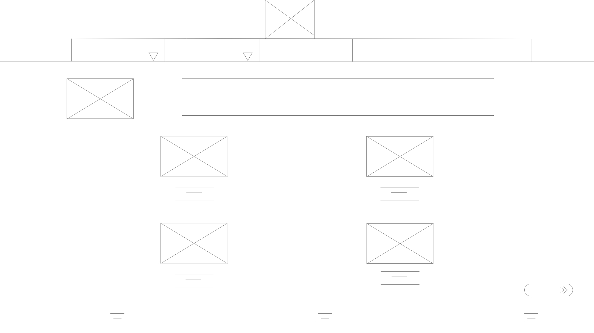
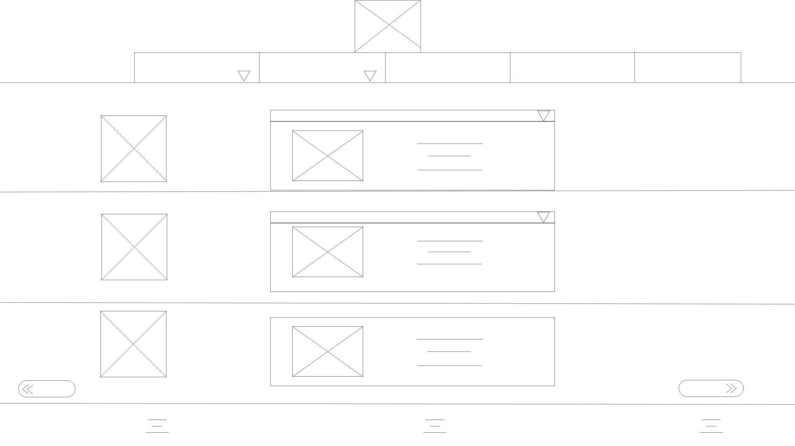
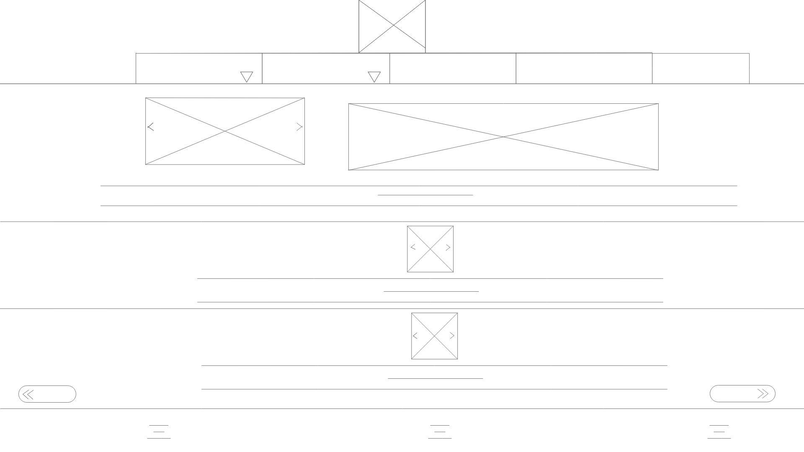
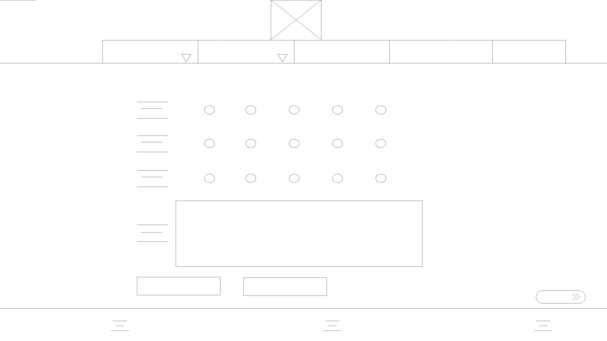
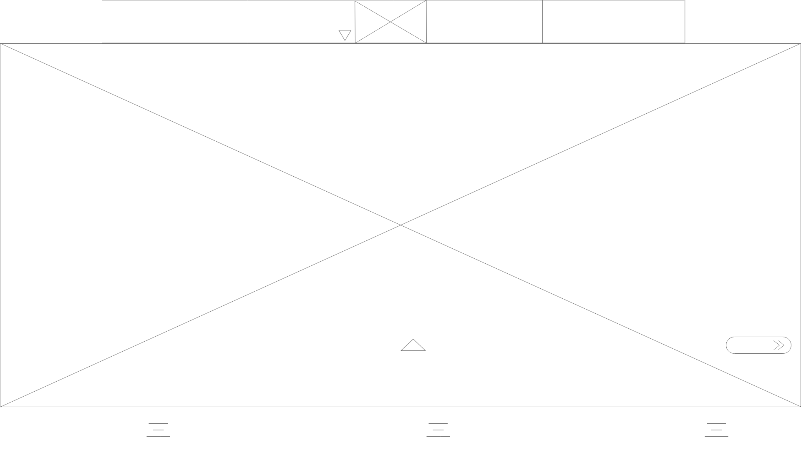
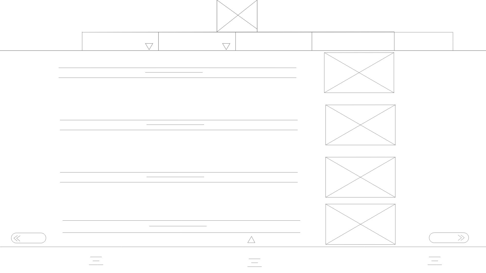
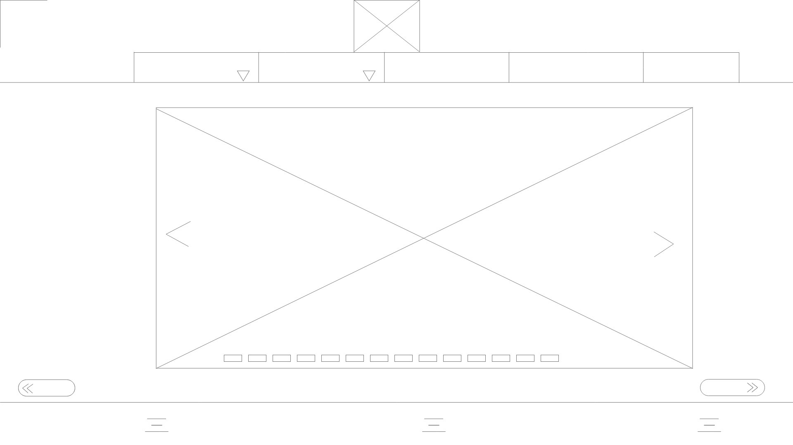
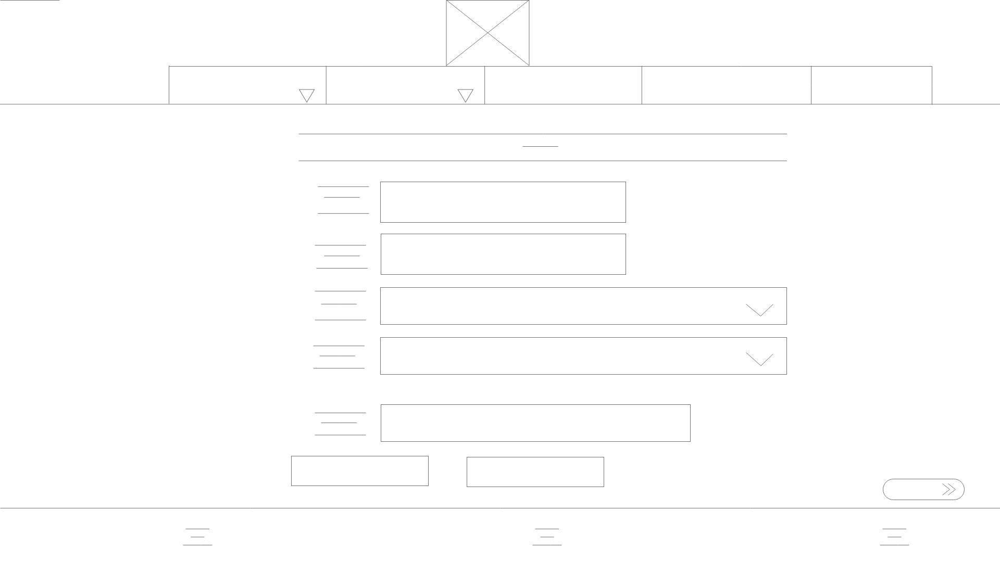

# ASG1

Personal Website: Personal Portfolio Website, Company Website

All webpages common things:

- Navigation Bar Requirements: Logo, Homepage, Education, CCA, Hobbies, Contact
- Footer: Icon: Social Media, Email, and All Right Reserved
- Navigation buttons 

Portfolio Website:

Page No. 1: Homepage
Purpose: Display the overall content of my website

Things to include:

- Slides of my pictures with title
- The 4 main contents of my website (BOXES)
- Animation of Boxes

Page No. 2:  Education 
Purpose: Share about my academics achievement since primary till current

Things to include:

- Include dropdown box for users to choose achievement  
- School logo that link to each of the schools website

Page No. 3: CCA
Purpose: Share about my CCA since primary till current

Things to include:

- Include slides of pictures and description of what I have done

Page No. 4: Hobbies
Purpose: Share about what I like to spend with my free time

Things to include:
- A short clip about what have I done
- Include slides of pictures and description of what I have done
- A link to my personal company

Page No. 5: Feedback
Purpose: Allow users to input for their Name, Gmail and a short message to me

Things to include:
- A form
- Submit and Clear form buttons

Company Website:

Page No. 1: Sign In 
Purpose: Allow users to enter their email and password to enter the webpage

Things to include:

-  input text box and a login button

Page No. 2: Homepage
Purpose: Display picture related to my company

Things to include:

-  Auto ImageSlides of picture

Page No. 3:  About Us 
Purpose: Share about my company such as the founder and patnership

Things to include:

- Include dropdown box for users to choose achievement  
- School logo that link to each of the schools website

Page No. 4:  Products 
Purpose: Share about my company products
Things to include:

- Include auto slides of company products
- Description of those products

Page No. 5:  Gallery
Purpose: Share about some image takenn by the founder
Things to include:

- Include manual slider show

Page No. 6:  Chekout 
Purpose: Allow users to give feedback by filling up a form
Things to include:

- A button and textarea form 
- Submit and Clear form buttons

Personal Portfolio Website WireFrame:

Index: 

Education: 

CCA: 

Hobby: 

Contact Me: 

Company Website:

Homepage: 

About Us: 

Products: 

Gallery: 

Checkout: 
